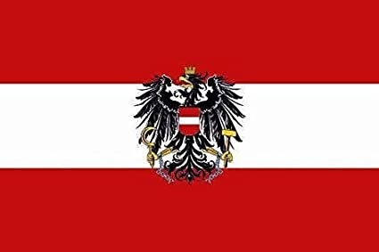

<html lang="en">

  <head>
  <meta charset="UTF-8">
  <link rel="stylesheet" type="text/css" href="main.css">
   <h1 align="center">Webseite</h1>
</head>
<body>
  <h2> About me </h2>
  <>
  

 <a src="https://github.com/CarinaMarieWagner/carinawagner.github.io/blob/main/%C3%96sterreichflagge.jpg">
  
  
   
   
   
  
My name is Carina Wagner, I am from Austria and I just turned 16 years old. I am a technical chollege studend and looking forward to starting my 3rd year in september. I am living together with mother Petra, my father Christian, my sister Lisa and my two dogs Brenda and Terry. In my freetime I usually hang out with some friends. I am also teamcaptain and player for an esports team.

  
I am trying really hard to learn something new for my software skills nearly daily. I started doing some small projects in blender. I made a lot of pictures and a handful small animations in this programm already using some characters from a video game. I also started sculpting in blender but there are still some possibilies i haven't found out yet. I also did a few little webseites, but there is also still a lot to improve and getting better with.
  

  <h2>My Contact informations</h2>
  <article>Carina Wagner</article>
  <article>Kleopferstraße</article>
  <article>Vienna,1220</article>
  <h2>Schools</h2>
<ol>
  <li>Higher technical chollege in Austria</li>
  <article>started 2019</article>
   
<a href="https://www.htl-donaustadt.at">→HTL Donaustadt Webseite</a>

  <li>Gymnasium</li>
  <article>started 2015 finished 2019</article>
  
<a href="https://www.brg-seestadt.at">→Gymnasium Contiweg Webseite</a>

  <li>First School in Austria</li>
  <article>started 2011 finished 2015</article>
  
<a href="http://www.offene-volksschule-an-der-lobau.at/Startseite/">→Esslinger Volkschule Webseite</a>
 
</ol>
  <h2>Technical Skills</h2>
  <ul>
    <li>Word                          ● ● ● ● ○</li>
    <li>Exel                          ● ● ● ○ ○</li>
    <li>PowerPoint                    ● ● ● ● ○</li>                
    <li>basic HTML-skills             ● ● ○ ○ ○</li> 
    <li>basic CSS-skills              ● ● ○ ○ ○</li>
    <li>basic Blender-skills          ● ● ● ○ ○</li>
    <li>little Photoshop knowledge    ● ○ ○ ○ ○</li>
  </ul> 
  <h2> Languages</h2>
<ul>
  <li>German  ● ● ● ● ○</li>
  <li>English ● ● ○ ○ ○</li>
</ul>
<h2>Hobbys</h2>
<ul>
  <li>riding bike🚴︁</li>
  <li>meeting friends👤︁</li>
  <li>playing computergames 🎮︁</li>
  <li>beeing a captain and player of an esport team🏅︁</li>
  <li>working with blender🎥︁</li>
  <li>listening to music 🎧︁</li>
  <li>reading 📖︁</li>
  <li>playing with my sister🏓︁</li>
  <li>cooking 🍴︁</li>
  <li>backing 🥧︁</li>
  </ul>
</body>
<footer> 
  <h6>Carina Wagner</h6>
  <h6>Munich on the 03/08/2021</h6>
 </footer>
</html>
